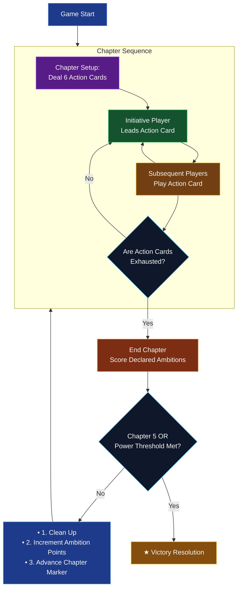
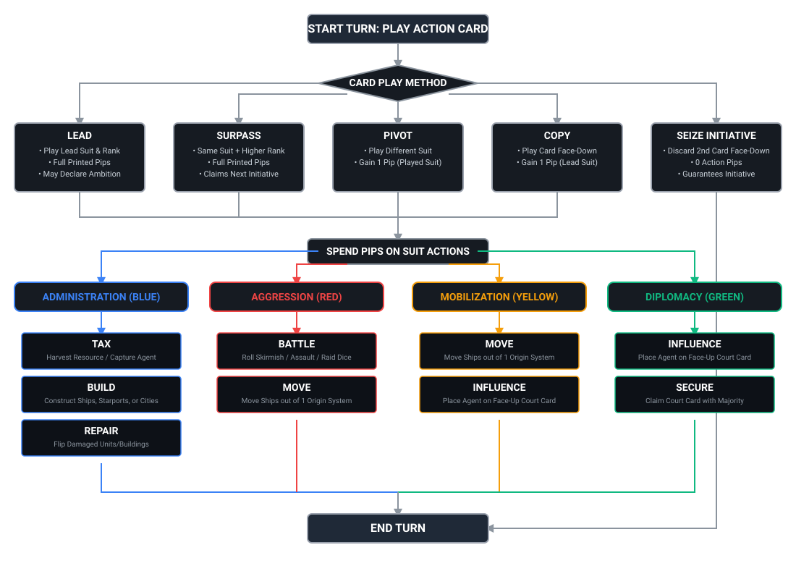

# Arcs: Conflict & Collapse in the Reach

## 1. OVERVIEW

- **Game Type/Genre:** Asymmetric Space Opera / Area Control / Action-Selection Trick-Taking
- **Complexity Rating:** 3.7 / 5.0 (BoardGameGeek Weight). High cognitive load driven by trick-taking action optimization, dynamic objective scoring, tactical combat risk management, and multi-layered card management.
- **Player Count Scaling:** 2 to 4 Players.
  - *2-3 Players:* Map bounds are constricted using sector overlays to maintain spatial tension. Action deck size is compressed (cards numbered 1 and 7 are removed) to preserve tight trick competition.
  - *4 Players:* Full map layout utilized. Full card deck (ranks 1–7 included) creates maximum initiative competition and Court turnover.
- **Reference Links:**
  - [Official Publisher Site](https://ledergames.com/products/arcs)
  - [BoardGameGeek Page](https://boardgamegeek.com/boardgame/359871/arcs)

### Description

The galactic empire is crumbling into chaos as the central Reach collapses into feudal rivalry. As a rogue fleet commander, you must exploit the breakdown of imperial authority to forge a new dynasty from the ashes. Harness lingering galactic institutions, seize crucial star systems, and burn down your rivals before the empire goes dark forever.

You represent an ambitious star-faring faction leveraging military power, resource monopolies, and political influence within the Imperial Court to dictate the macro priorities of the Reach.

Your goal is to score Power (Victory Points) across five Chapters by declaring Ambitions, holding key star systems, securing courtly influence, and plundering resources or enemy trophies before the game concludes.

## SETUP

### Global Board Setup

1. **Unfold Board:** Place the Reach map central to all players. Attach sector overlays according to player count (4 players use the full map; 2–3 players restrict outer systems).
1. **Set Up Ambition Board:** Position the Ambition Board adjacent to the Reach map. Place the 5 Ambition Markers (Tycoon, Tyrant, Warlord, Keeper, Empath) nearby in the supply.
1. **Form General Supply:** Separate and organize all Ships, Starports, Cities, Resources (Fuel, Material, Weapons, Relics, Psionic), and Dice (Skirmish, Assault, Raid) into accessible pools.
1. **Prepare the Court Deck:** Shuffle the Guild / Court deck and deal 3 cards face-up into the Court display next to the map (2 cards in a 2-player game). Place the remaining deck face-down.
1. **Prepare the Action Deck:** Configure the Action deck for player count (remove '1' and '7' rank cards in 2- or 3-player games).

### Individual Player Setup

1. **Faction Assignment:** Each player selects a color and collects their faction components: 15 Ships, 3 Starports, 3 Cities, and Player Board.
1. **Draft Leaders & Lore (Optional Advanced Setup):** Draft 1 Leader card and 1 Lore card per player to define starting unique abilities, resources, and asymmetric board setups.
1. **Initial Board Placement:** Place starting Starports, Cities, and Ships across designated starting systems following standard setup sheets or Leader card instructions.
1. **Distribute Starting Resources:** Take designated starting resource tokens into your player board slots.
1. **Determine First Initiative:** Assign the Initiative Marker to the starting player.

## HOW TO WIN & GAME END

- **Primary Win Condition:** Highest cumulative **Power** (Victory Points) at the end of the game or reaching the instant-win Power threshold.
- **End-Game Trigger:** The game ends immediately after resolving the **Scoring Phase** of **Chapter 5**, OR as soon as a player hits/exceeds the Power threshold at the end of any Chapter scoring:
  - **4 Players:** 27 Power
  - **3 Players:** 30 Power
  - **2 Players:** 33 Power
- **Tie-Breaker Hierarchy:**
  1. Break ties in clockwise turn order starting from the player currently holding the **Initiative Marker**.

## HOW TO PLAY OVERVIEW

### Round Phases

A full game consists of up to **5 Chapters**. Each Chapter follows three rigid phases:

0. **Setup Phase:** The Initiative player shuffles the Action deck and deals **6 Action Cards** face-down to each player.
1. **Action Phase (6 Turns):**
   - Played in a series of rounds until all players have exhausted their cards.
   - The player holding **Initiative** plays the lead card, setting the active suit.
   - Other players play one card sequentially to **Lead**, **Surpass**, **Pivot**, or **Copy**.
1. **Chapter Cleanup & Scoring Phase:**
   - Resolve and score any **Ambitions** declared during the Chapter.
   - Clear and reset ambition markers.
   - Pass or retain Initiative based on card trick outcomes.
   - Advance the Chapter marker.

## TURN ACTIONS

### Step 1: Card Play Methods

*Determines how many Pips you generate and who holds Initiative.*

| Method               | Card Requirement                     | Pip Yield                  | Special Effect                                                |
| :------------------- | :----------------------------------- | :------------------------- | :------------------------------------------------------------ |
| **Lead**             | Any card (Initiative holder only)    | Full printed pips          | May declare a matching **Ambition** indicator                 |
| **Surpass**          | Same suit, **higher rank** than Lead | Full printed pips          | Claims **Initiative** for next round (evaluated at round end) |
| **Pivot**            | Different suit than Lead             | **1 Pip** (of played suit) | Allows taking actions when lacking the lead suit              |
| **Copy**             | Any card played **face-down**        | **1 Pip** (of lead suit)   | Conceals card rank from opponents                             |
| **Seize Initiative** | Discard 2nd card face-down           | **0 Pips**                 | **Guarantees Initiative** next round                          |

### Step 2: Suit Actions

*Spend your generated Pips on actions matching your card's suit.*

- **Administration (Blue Suit)**

  - **Build:** Construct a Ship at a friendly Starport, or construct/upgrade Starports and Cities on controlled planets.
  - **Tax:** Harvest 1 Resource token from a planet with a City you control, or capture 1 rival agent from a Court card.
  - **Repair:** Flip 1 damaged Ship or structure back to its healthy side per Pip spent.

- **Aggression (Red Suit)**

  - **Battle:** Initiate combat in a system where you have Ships.
  - **Move:** Move any number of Ships out of **one** origin system to adjacent connected systems.

- **Mobilization (Yellow Suit)**

  - **Move:** Move any number of Ships out of **one** origin system to adjacent connected systems.
  - **Influence:** Place 1 Influence agent onto a face-up Court card matching your fleet/Starport positions.

- **Diplomacy (Green Suit)**

  - **Influence:** Place 1 Influence agent onto a face-up Court card.
  - **Secure:** Claim a Court card where you hold majority Influence, adding its persistent power/guild assets to your tableau.

### Step 3: Combat Mechanics

*Executed when spending a Pip on a **Battle** action (Aggression suit).*

Attackers roll dice up to their total Ship count in the target system. Defenders roll **zero** dice.

| Die Type            | Combat Role            | Primary Risk / Reward                                                 |
| :------------------ | :--------------------- | :-------------------------------------------------------------------- |
| **Skirmish (Blue)** | Safe / Tactical        | Low hit output, but zero risk of self-damage                          |
| **Assault (Red)**   | Heavy Offense          | High hit output, high risk of destroying own attacker ships           |
| **Raid (Yellow)**   | Resource / Court Theft | Steals Resources, Keys, or Court Cards; carries high self-damage risk |

______________________________________________________________________

### What's Hidden vs. Open

- **Public / Open Information:** All units, board structures, player resource tokens, Court cards, declared Ambitions, Power scores, and discard piles.
- **Private / Hidden Information:** Action cards held in hand, face-down Action cards played when **Copying** or **Seizing**.

## FACTION QUIRKS & EASY MISTAKES

### Asymmetry Overview

Base mechanics are symmetric, but asymmetry is introduced through **Leaders & Lore**:

- **Leaders:** Alter starting piece counts, system setups, and grant ongoing abilities.
- **Lore Cards:** Modify action costs, grant unique resource interactions, or expand combat/movement capabilities.

### Easy Mistakes

1. **Misunderstanding Pivoting vs. Copying:** Playing a higher rank card in a *different suit* is a **Pivot** (yielding 1 Pip of your card's suit), **not** a Surpass.
1. **Declaring Ambitions Without Initiative:** Ambitions can only be declared by the player who **Leads** the round.
1. **Tie-Breaker Assumptions:** Victory ties are resolved **strictly by clockwise turn order from the Initiative marker**, not by counting pieces or resources.
1. **Seizing Initiative Yields Zero Actions:** Sacrificing a card to Seize Initiative immediately grants no action pips for that turn.
1. **Resource Capacity Limits:** Excess resources exceeding player board slot capacity are lost immediately.

## PRO-TIPS & META STRATEGY

### Opening Moves

- **Evaluate Hand Rank Spread:** If dealt low cards, plan to **Copy** or **Pivot** early to save high cards for late-round initiative control.
- **Anchor Starports Early:** Build early Starports on systems producing Fuel (movement flexibility) or Weapons (combat leverage).

### Core Synergies

- **Court Influence into Raiding:** Use **Influence** to seed Court cards, then initiate battles using **Raid Dice** to strip cards and resources directly from rivals.
- **Fuel Bank Engine:** Hoard Fuel to bypass action limits—spending Fuel during your Prelude gives bonus ship movements outside your card's pip budget.

### Pacing & Tempo

- **Managing Initiative:** Leading gives control over suits and Ambition declarations, but burns high-value cards early. Passing initiative mid-Chapter allows banking high cards to control the final scoring rounds.
- **Dynamic Ambition Pivoting:** Avoid over-committing to an undeclared Ambition early; keep flexible positions so you can capitalize on whichever Ambition the Lead player is forced to declare.
